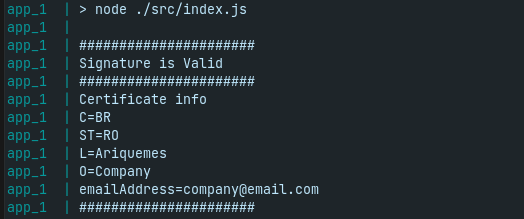

# Stupid digital signature example
## About
This project is a test of crypto node library.

## Running
__Requirements:__ Docker and Docker Compose.

- Rename the __.env-example__ to __.env__.

- Execute in your terminal the command:
```sh
docker-compose -f docker-compose.yaml up
```
- You will see:



## Reference
IBM. __Gerando um certificado autoassinado usando o openssl__. 2021. Last access in: Jun 04, 2022. Avaiable in: <"https://www.ibm.com/docs/pt-br/api-connect/5.0.x?topic=profiles-generating-self-signed-certificate-using-openssl">.
